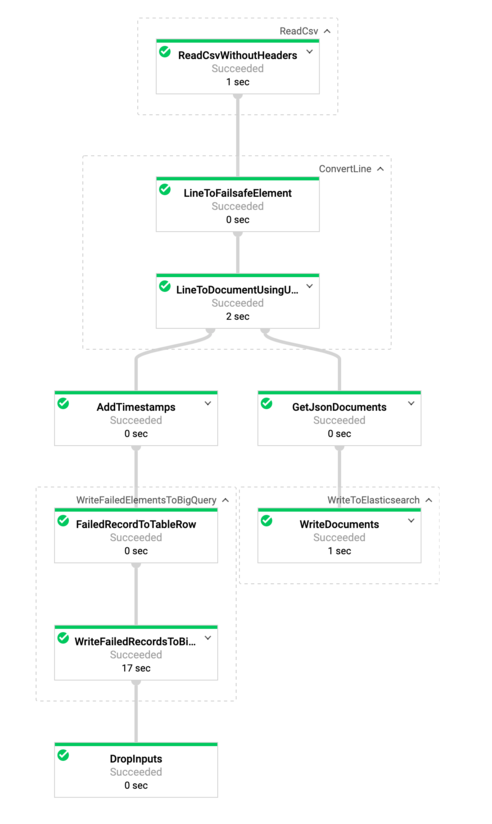

# CSV to Elasticsearch Dataflow Template

The [CsvToElasticsearch](src/main/java/com/google/cloud/teleport/v2/templates/CsvToElasticsearch.java) pipeline ingests 
data from one or more CSV files in Google Cloud Storage into Elasticsearch. The template creates the schema for the 
JSON document using one of the following:
1. Javascript UDF (if provided)
2. JSON schema (if provided)
3. CSV headers* (default)

If either a UDF or JSON schema is provided then it will be used instead of the CSV headers.

\*<b>NOTE:</b> All values will be written to Elasticsearch as strings if headers are used.

Pipeline flow is illustrated below:



## Getting Started

### Requirements
* Java 8
* Maven
* Cloud Storage bucket exists
* Elasticsearch nodes are reachable from the Dataflow workers
* Csv schema is the same for all Csvs.

### Building Template
This is a dynamic template meaning that the pipeline code will be containerized and the container will be 
run on Dataflow. 

#### Building Container Image
* Set environment variables
```sh
export PROJECT=my-project
export IMAGE_NAME=my-image-name
export BUCKET_NAME=gs://<bucket-name>
export TARGET_GCR_IMAGE=gcr.io/${PROJECT}/${IMAGE_NAME}
export BASE_CONTAINER_IMAGE=gcr.io/dataflow-templates-base/java8-template-launcher-base
export BASE_CONTAINER_IMAGE_VERSION=latest
export APP_ROOT=/template/<template-class>
export COMMAND_SPEC=${APP_ROOT}/resources/csv-to-elasticsearch-command-spec.json
export NODE_ADDRESSES=comma-separated-list-nodes
export INPUT_FILE_SPEC=my-file-spec
export JSON_SCHEMA_PATH=gs://path/to/json/schema
export INDEX=my-index
export DOCUMENT_TYPE=my-type
export HEADERS=false
export DELIMITER=","
export LARGE_NUM_FILES=false
export DEADLETTER_TABLE=my-project:my-dataset.my-deadletter-table
export JS_PATH=gs://path/to/udf.js
export JS_FUNC_NAME=my-function-name
```
* Build and push image to Google Container Repository
```sh
mvn clean package -Dimage=${TARGET_GCR_IMAGE} \
                  -Dbase-container-image=${BASE_CONTAINER_IMAGE} \
                  -Dbase-container-image.version=${BASE_CONTAINER_IMAGE_VERSION} \
                  -Dapp-root=${APP_ROOT} \
                  -Dcommand-spec=${COMMAND_SPEC}
```

#### Creating Image Spec

Create file in Cloud Storage with path to container image in Google Container Repository.
```json
{
  "docker_template_spec": {
    "docker_image": "gcr.io/project/my-image-name"
  }
}
```

### Testing Template

The template unit tests can be run using:
```sh
mvn test
```

### Executing Template

The template requires the following parameters:
* inputFileSpec: Pattern to where data lives, ex: gs://mybucket/somepath/*.csv
* nodeAddresses: Comma separated list of Elasticsearch nodes to connect to, ex: http://my-node1,http://my-node2
* index: The index toward which the requests will be issued, ex: my-index
* documentType: The document type toward which the requests will be issued, ex: my-document-type
* containsHeaders: Set to true if file(s) contain headers. 
* deadletterTable: Deadletter table in BigQuery for failed inserts in form: project-id:dataset.table
* delimiter: Delimiting character in CSV file(s). Default: use delimiter found in csvFormat
* csvFormat: Csv format according to [Apache Commons CSV format](https://commons.apache.org/proper/commons-csv/apidocs/org/apache/commons/csv/CSVFormat.html). Default is: Default
<br><b>NOTE:</b> Must match format names exactly found [here](http://commons.apache.org/proper/commons-csv/apidocs/org/apache/commons/csv/CSVFormat.Predefined.html#Default) 

The template has the following optional parameters:
* jsonSchemaPath: Path to JSON schema, ex gs://path/to/schema. Default: null.
* largeNumFiles: Set to true if number of files is in the tens of thousands. Default: false
* batchSize: Batch size in number of documents. Default: 1000
* batchSizeBytes: Batch size in number of bytes. Default: 5242880 (5mb)
* javascriptTextTransformGcsPath: Gcs path to javascript udf source. Udf will be preferred option for transformation if supplied. Default: null
* javascriptTextTransformFunctionName: UDF Javascript Function Name. Default: null
* maxRetryAttempts: Max retry attempts, must be > 0. Default: no retries
* maxRetryDuration: Max retry duration in milliseconds, must be > 0. Default: no retries
* usePartialUpdates: Set to true to issue partial updates. Default: false
* idFnPath: Path to javascript file containing function to extract Id from document, ex: gs://path/to/idFn.js. Default: null
* idFnName: Name of javascript function to extract Id from document. Default: null
* indexFnPath: Path to javascript file containing function to extract Index from document, ex: gs://path/to/indexFn.js. Default: null
* indexFnName: Name of javascript function to extract Index from document. Default: null
    * Will override index provided.
* typeFnPath: Path to javascript file containing function to extract Type from document, ex: gs://path/to/typeFn.js. Default: null
* typeFnName: Name of javascript function to extract Type from document. Default: null
    * Will override type provided.

Template can be executed using the following API call:
```sh
API_ROOT_URL="https://dataflow.googleapis.com"
TEMPLATES_LAUNCH_API="${API_ROOT_URL}/v1b3/projects/${PROJECT}/templates:launch"
JOB_NAME="csv-to-elasticsearch-`date +%Y%m%d-%H%M%S-%N`"
time curl -X POST -H "Content-Type: application/json"     \
     -H "Authorization: Bearer $(gcloud auth print-access-token)" \
     "${TEMPLATES_LAUNCH_API}"`
     `"?validateOnly=false"`
     `"&dynamicTemplate.gcsPath=gs://path/to/image/spec"`
     `"&dynamicTemplate.stagingLocation=gs://path/to/stagingLocation" \
     -d '
      {
       "jobName":"'$JOB_NAME'",
       "parameters": {
                   "inputFileSpec":"'$INPUT_FILE_SPEC'",
                   "nodeAddresses":"'$NODE_ADDRESSES'",
                   "index":"'$INDEX'",
                   "documentType":"'$DOCUMENT_TYPE'",
                   "containsHeaders":"'$HEADERS'",
                   "delimiter":"'$DELIMITER'",
                   "deadletterTable":"'$DEADLETTER_TABLE'",
                   "javascriptTextTransformGcsPath":"'$JS_PATH'",
                   "javascriptTextTransformFunctionName":"'$JS_FUNC_NAME'",
        }
       }
      '
```
